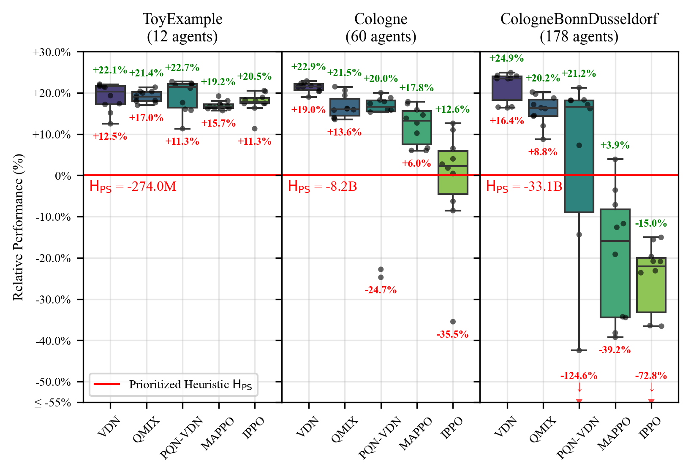

# JaxMARL for IMP-act
This repository intergrates the [JAXMARL](https://github.com/FLAIROx/JaxMARL) library with [IMP-act](https://github.com/AI-for-Infrastructure-Management/imp-act), a MARL environment that models the interaction between maintenance actions and traffic dynamics in transportation networks under global budget constraints.

## Installation

### 1. Clone the repositories

To clone this repository and the imp-act repository, run:
```bash
git clone https://github.com/AI-for-Infrastructure-Management/imp-act-JaxMARL.git
cd imp-act-JaxMARL && git checkout submission
git clone https://github.com/AI-for-Infrastructure-Management/imp-act.git
```

### 2. Create a virtual environment

Option A: Create a conda environment using the environment YAML file,
```bash
conda env create -f conda_environment.yaml
conda activate impact-jaxmarl-env
```

Option B: Create a virtual environment `impact-jaxmarl-env` using venv/poetry etc.
```bash
# create `impact-jaxmarl-env` with python=3.10
pip install poetry==1.7.1 lockfile==0.12.2
```

### 3.Install dependencies 

**Option A: JAX CPU version**

- Install dependencies for JaxMARL using pyproject.toml
```bash
pip install -e ".[algs]"
```

- Install dependencies for imp-act
```bash
cd imp-act && git checkout main
poetry install --with dev,vis,jax
```
<details>
<summary>Optional: Troubleshooting and Additional Notes</summary>

- If `cmake` is not installed, you can install it using:
    ```bash
    sudo apt-get install cmake  # For Ubuntu/Debian
    brew install cmake          # For macOS
    ```
</details>

**Option B: JAX GPU version**

To install the GPU version jax, we need to install the `jax[cuda12]` version. 
In pyproject.toml, remove "jax==0.4.30" and use "jax[cuda12]==0.4.30" for GPU installation

```bash
pip install -e ".[algs]"

# check JAX GPU installation 
# (should return somthing like [cuda(id=0)])
python -c "import jax; print(jax.devices())"
```

<details> 
<summary>vast.ai GPU instance</summary>

Create a GPU instance on vast.ai using the pre-built docker image `omniscientoctopus/imp-act-jaxmarl` to quickly get started.

Make sure to filters GPUs with CUDA >=12.8. After creating an instance, can run the examples below to check the installation.

```bash
cd imp-act-JaxMARL && conda activate impact-jaxmarl-env
```
</details>

### 4. Examples
```bash
cd ..
python experiments/example_mpe.py # checks JaxMARL installation
python experiments/example_road_env.py # checks imp-act + JaxMARL installation
```

## Docker Image
Alternatively, you can quickly get started using the pre-built Docker image. You can pull the image from Docker Hub:
```bash
docker pull omniscientoctopus/imp-act-jaxmarl
```


## Reproducing Results 
To reproduce the results in the paper please refer to the [Reproducing_Results.md](Reproducing_Results.md) file.

## Results

Normalized best policy returns, for all tested IMP-act environments and MARL algorithms over 10 training seeds. Returns are normalized with respect to the baseline heuristic policy $\text{H}_\text{PS}$.

Best performance per algorithm in terms of expected return, 95% CI, and required VRAM for each environment. The best performance per environment is highlighted in bold, and performances within their 95% CI are marked with *.

### **Toy-Example** ($\text{H}_\text{PS}=-274\text{M}$)

| Algorithm           | $\Delta \bar{R}^{\pi}_0$ | 95% CI             | VRAM (GB) |
| :------------------ | -----------------------: | :----------------: | -----------: |
| VDN                 | *+22.09%                 | [21.35, 22.81]   | 0.52         |
| QMIX                | *+21.37%                 | [20.54, 22.15]   | 1.55         |
| PQN-VDN             | **+22.72%**                 | [21.98, 23.46]   | 0.16         |
| MAPPO               | +19.22%                  | [18.38, 20.04]   | 0.85         |
| IPPO                | +20.54%                  | [19.76, 21.30]   | 1.87         |
| $\text{VDN}_{\text{BA}}$ | +23.04%                  | [20.69, 25.31]   | --           |

### **Cologne** ($\text{H}_\text{PS}=-8.2\text{B}$)

| Algorithm           | $\Delta \bar{R}^{\pi}_0$ | 95% CI             | VRAM (GB) |
| :------------------ | -----------------------: | :----------------: | -----------: |
| VDN                 | **+22.88%** | [22.59, 23.16]   | 5.94         |
| QMIX                | +21.48%                  | [21.17, 21.80]   | 7.72         |
| PQN-VDN             | +20.01%                  | [19.70, 20.30]   | 0.77         |
| MAPPO               | +17.85%                  | [17.51, 18.17]   | 13.13        |
| IPPO                | +12.62%                  | [12.30, 12.93]   | 1.29         |
| $\text{VDN}_{\text{BA}}$ | +24.57%                  | [23.67, 25.42]   | --           |

### **CologneBonn-Dusseldorf** ($\text{H}_\text{PS}=-33.1\text{B}$)

| Algorithm           | $\Delta \bar{R}^{\pi}_0$ | 95% CI             | VRAM (GB) |
| :------------------ | -----------------------: | :----------------: | -----------: |
| VDN                 | **+24.91%** | [24.71, 25.10]   | 12.09        |
| QMIX                | +20.19%                  | [19.97, 20.40]   | 10.37        |
| PQN-VDN             | +21.24%                  | [21.04, 21.45]   | 2.29         |
| MAPPO               | +3.89%                   | [3.67, 4.10]     | 16.45        |
| IPPO                | -15.03%                  | [-15.31, -14.75] | 2.14         |
| $\text{VDN}_{\text{BA}}$ | +25.70%                  | [25.09, 26.29]   | --           |


# Licence Disclaimer
This file was modified from the original JaxMARL repository in the process of creating the imp-act adaption of JaxMARL. The original repository can be found at [JaxMARL](https://github.com/FLAIROx/JaxMARL). 

It is used under the Apache License 2.0. The original license can be found at [Apache License 2.0](https://www.apache.org/licenses/LICENSE-2.0) in addition to the licence file in this repository. [JaxMARL License](LICENSE).
